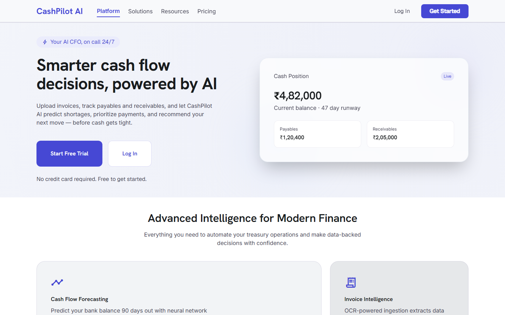
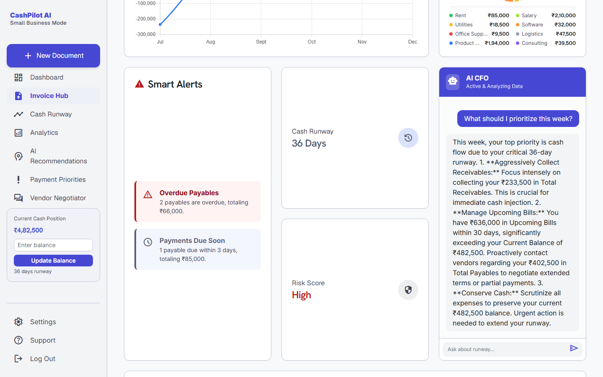
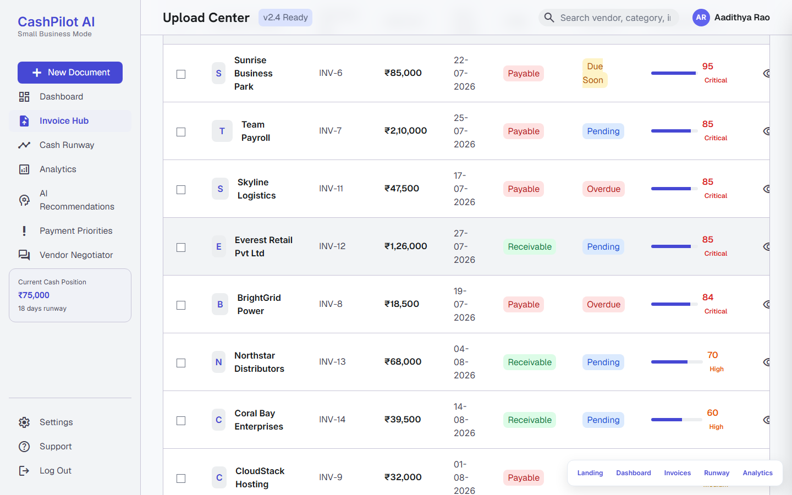
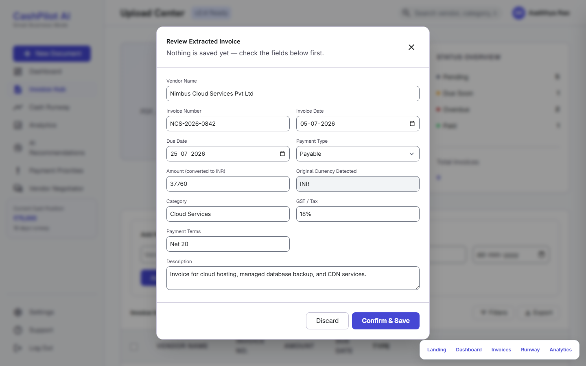
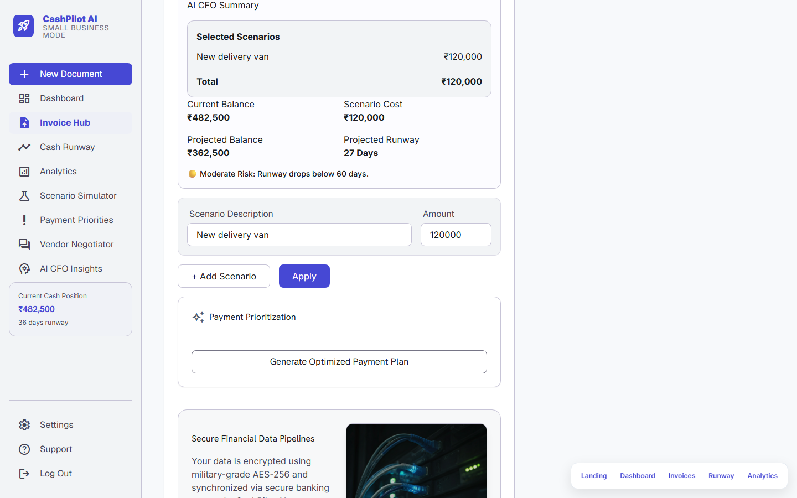
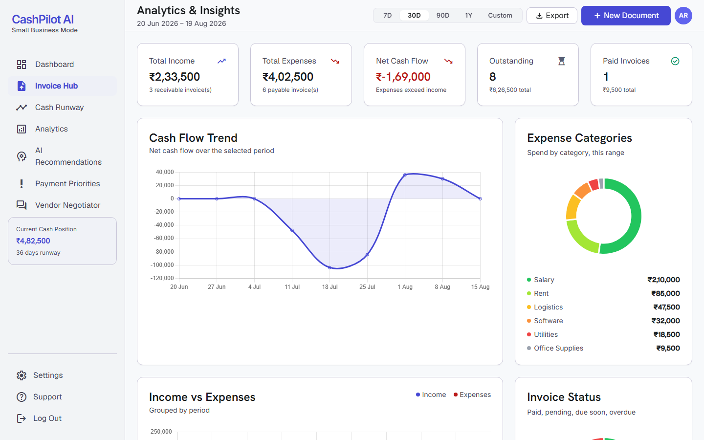

# CashPilot AI 💰🤖

**Your Intelligent CFO Assistant** — an AI-powered cash flow platform that helps small businesses track payables and receivables, prioritize payments, simulate financial scenarios, and get CFO-level recommendations in seconds.

---

## Overview

Small businesses often make financial decisions based only on their current bank balance, without factoring in upcoming bills, pending receivables, or payment urgency. CashPilot AI closes that gap by combining structured invoice data with a weighted priority-scoring engine and Google Gemini–powered financial reasoning, so business owners can move from reactive money management to proactive planning.

The app covers the full loop: upload an invoice → AI extracts the details → the invoice is scored and prioritized → the dashboard and analytics surface risk → the AI CFO recommends what to do next.

---

## Features

- **🔐 Authentication** — Email/password signup, login, forgot/reset-password flow, and JWT-secured sessions.
- **📊 Dashboard** — Real-time view of cash balance, total payables/receivables, upcoming bills, cash runway, and invoice count.
- **📄 Invoice Hub** — Create, edit, mark-as-paid, and delete payables/receivables; each invoice is auto-scored with an AI Priority Score.
- **🧾 AI Invoice Extraction** — Upload a PDF, scanned PDF, or image (JPG/PNG) invoice and let Gemini extract vendor, amount, due date, GST, invoice number, and more for review before saving.
- **🎯 AI Payment Prioritization** — A weighted model (50% due-date urgency, 30% invoice amount, 20% category importance) ranks payables into Critical / High / Medium / Low priority.
- **📈 Cash Runway Calculator** — `Runway = (Current Balance / Monthly Burn Rate) × 30`, kept in sync with live invoice data.
- **🔮 Scenario Simulator** — Model a hypothetical expense and instantly see projected balance, projected runway, and risk level before committing.
- **🤖 AI CFO Recommendation Engine** — Gemini analyzes cash position, payables, receivables, runway, and scenario impact to return a risk level, recommendation, key concern, and suggested actions.
- **💬 AI CFO Chat Assistant** — A finance-scoped chatbot that answers only cash-flow/runway/payables/receivables questions, grounded in the user's real data.
- **📉 Analytics Dashboard** — Category-wise expense breakdown, AI-generated key insights, risks, and recommendations derived from actual invoice history.
- **🤝 Vendor Negotiation Assistant** — Generates a ready-to-send email requesting a payment extension, early-payment discount, or installment plan.

---

## Tech Stack

**Frontend**
- [TanStack Start](https://tanstack.com/start) (React 19 + TanStack Router) as the app shell / file-based router
- Static screens (`public/screens/*.html`) built with HTML, vanilla JS, and Tailwind CSS (CDN), rendered per-route via an `<iframe>` shell (`ScreenFrame.tsx`)
- shadcn/ui + Radix UI primitives and Recharts available in `src/components/ui` for the React layer
- Vite 7 for dev/build tooling, Bun for package management

**Backend**
- [FastAPI](https://fastapi.tiangolo.com/) (Python)
- SQLAlchemy ORM over SQLite (`cashpilot.db`)
- JWT authentication (`python-jose`) with bcrypt password hashing
- PyMuPDF for PDF/image text extraction

**AI Layer**
- Google Gemini (`gemini-2.5-flash`) via `langchain-google-genai` for extraction, recommendations, chat, and vendor negotiation copy

---

## Architecture / Workflow

```
                    ┌─────────────────────────────┐
                    │   Browser (TanStack Start)  │
                    │  React shell + file routes  │
                    └───────────────┬─────────────┘
                                    │ iframes
                    ┌───────────────▼─────────────┐
                    │  public/screens/*.html + JS  │
                    │  (Dashboard, Invoices,       │
                    │   Analytics, Runway, Auth)   │
                    └───────────────┬─────────────┘
                                    │ fetch (api.js) + JWT bearer token
                    ┌───────────────▼─────────────┐
                    │        FastAPI Backend        │
                    │ ── Auth Service (JWT/bcrypt)  │
                    │ ── Invoice Management         │
                    │ ── Invoice Extraction (Gemini)│
                    │ ── Payment Prioritization      │
                    │ ── Cash Runway / Dashboard     │
                    │ ── Scenario Simulator          │
                    │ ── AI CFO Recommendation       │
                    │ ── CFO Chat                    │
                    │ ── Vendor Negotiation           │
                    └───────────────┬───────────────┘
                                    │
                        ┌───────────┴───────────┐
                        ▼                       ▼
                 SQLite (cashpilot.db)     Google Gemini API
```

**Request flow:** the React shell renders a thin `<iframe>` per route pointing at a static screen in `public/screens/`; those screens call the FastAPI backend directly via `api.js`, attaching the JWT stored in `localStorage`/`sessionStorage`. The backend reads/writes SQLite through SQLAlchemy and calls Gemini for every AI-driven feature (extraction, insights, chat, negotiation).

---

## Installation

### Prerequisites

- [Bun](https://bun.sh/) (frontend package manager/runtime)
- Python 3.11+
- A [Google Gemini API key](https://ai.google.dev/) (optional — AI features are disabled gracefully without one)

### 1. Clone and install frontend dependencies

```bash
git clone <repository-url>
cd CashFlow
bun install
```

### 2. Set up the backend

```bash
cd backend
python -m venv venv
venv\Scripts\activate        # Windows
# source venv/bin/activate   # macOS/Linux

pip install -r requirements.txt
```

Create `backend/.env`:

```env
GOOGLE_API_KEY=your_gemini_api_key
JWT_SECRET_KEY=generate_with_python_-c_"import secrets; print(secrets.token_hex(32))"
CORS_ORIGINS=http://localhost:8080
FRONTEND_URL=http://localhost:5173
```

### 3. Run the backend

```bash
uvicorn main:app --reload
```

The API starts on `http://127.0.0.1:8000`.

### 4. Run the frontend

```bash
# from the project root
bun run dev
```

The app starts on the Vite dev server (default `http://localhost:5173`). By default, `public/screens/api.js` targets `http://127.0.0.1:8000`; override it by setting `window.__CASHPILOT_API_URL__` before `api.js` loads if your backend runs elsewhere.

---

## Usage

1. Open the app and **sign up** for an account (or log in if you already have one).
2. From the **Dashboard**, set your current cash balance.
3. Go to **Invoices** to add payables/receivables manually, or **upload an invoice file** (PDF/JPG/PNG) and let AI extract the fields for review before saving.
4. Check the **Runway** page to view your projected cash runway and run **scenario simulations** for planned expenses.
5. Visit **Analytics** for category breakdowns, AI-generated insights, and the **Vendor Negotiation Assistant**.
6. Use the **AI CFO Chat** to ask business-finance questions grounded in your live data.

---

## Project Structure

```
CashFlow/
├── backend/
│   ├── main.py            # FastAPI app: auth, invoices, analytics, AI endpoints
│   ├── models.py           # SQLAlchemy models + Pydantic request schemas
│   ├── database.py         # SQLAlchemy engine/session setup
│   ├── extraction.py        # PDF/image text extraction + Gemini field parsing
│   ├── requirements.txt
│   └── uploads/             # Uploaded invoice files
├── public/
│   └── screens/            # Static HTML/JS screens (dashboard, invoices, analytics, runway, auth)
│       ├── api.js           # Shared API client + session helpers
│       └── *.html
├── src/
│   ├── routes/              # TanStack Start file-based routes (one per screen)
│   ├── components/
│   │   ├── ScreenFrame.tsx  # Iframes a public/screens/*.html page into a route
│   │   └── ui/               # shadcn/ui component library
│   ├── lib/                  # Config, error handling, utilities
│   ├── router.tsx / server.ts / start.ts   # TanStack Start entry points
│   └── styles.css
├── vite.config.ts
├── vercel.json
└── package.json
```

---

## API Documentation

Base URL: `http://127.0.0.1:8000` (local). All endpoints except `/`, `/register`, `/login`, `/forgot-password`, and `/reset-password` require a `Bearer <token>` header.

| Method | Endpoint | Description |
| --- | --- | --- |
| `POST` | `/register` | Create an account, returns an access token |
| `POST` | `/login` | Authenticate, returns an access token |
| `POST` | `/forgot-password` | Request a password reset link (always returns a generic response) |
| `POST` | `/reset-password` | Reset password using a reset token |
| `GET` | `/me` | Get the current user's profile |
| `PUT` | `/me` | Update name/company name |
| `POST` | `/change-password` | Change password (requires current password) |
| `GET` | `/dashboard` | Aggregated balance, payables, receivables, runway, and upcoming bills |
| `POST` | `/update-balance` | Update the current cash balance |
| `GET` | `/invoices` | List invoices with AI priority score and risk level |
| `POST` | `/manual-expense` | Create a payable/receivable |
| `PUT` | `/invoice/{invoice_id}` | Update an invoice (fields, paid status, etc.) |
| `DELETE` | `/invoice/{invoice_id}` | Delete an invoice |
| `POST` | `/upload-invoice` | Extract structured fields from an uploaded invoice file (does not persist it) |
| `GET` | `/payment-priority` | Payables ranked by AI priority score |
| `GET` | `/payment-plan` | Pay-now vs. delay plan given a safety balance threshold |
| `POST` | `/simulate-scenario` | Project new balance/runway for a hypothetical expense |
| `POST` | `/ai-recommendation` | Gemini-generated CFO recommendation (HTML) for a scenario |
| `GET` | `/analytics` | Category-wise spend breakdown |
| `GET` | `/analytics-summary` | Total spend, largest invoice, invoice count, categories |
| `GET` | `/analytics-insights` | AI-generated key insight, risks, and recommendations |
| `POST` | `/cfo-chat` | Ask the finance-scoped AI CFO chat assistant a question |
| `POST` | `/vendor-negotiation` | Generate a vendor negotiation email (extension/discount/installments) |

Interactive OpenAPI docs are also available at `http://127.0.0.1:8000/docs` while the backend is running.

---

## Screenshots

### Landing Page

The marketing/entry screen (`/`) — value proposition headline and feature overview. Gives a visitor a first impression of the product before they see any data.

### Dashboard + AI CFO Chat

The `/dashboard` screen with cash balance, total payables/receivables, cash runway, smart alerts, and the AI CFO chat panel open with a live question answered from real account data. This is the single best screen for showing the core value prop — real numbers plus an AI assistant reasoning about them — in one frame.

### Invoice Hub — AI Priority Scoring

The `/invoices` list view with several payables/receivables showing their AI Priority Score and risk level (Critical/High/Medium/Low) side by side. Demonstrates the weighted scoring engine at a glance without needing to explain the formula.

### AI Invoice Extraction

The "Review Extracted Invoice" modal right after a real invoice PDF is uploaded, showing the Gemini-extracted fields (vendor, amount, due date, GST, payment terms, etc.) awaiting user confirmation before anything is saved. Highlights the AI document-parsing feature, which is the most technically distinctive part of the project.

### Cash Runway & Scenario Simulator

The `/runway` screen after running a simulated scenario (a hypothetical expense), showing the projected balance, projected runway, and risk level. Shows the "what-if" planning feature that differentiates this from a plain expense tracker.

### Analytics Dashboard

The `/analytics` screen with income/expense/net-cash-flow summary cards, a cash flow trend chart, and a category-wise expense breakdown. Shows the financial-analytics feature that sits behind the AI insights and recommendations.

| Screen | File |
| --- | --- |
| Landing Page | `docs/screenshots/landing.png` |
| Dashboard | `docs/screenshots/dashboard.png` |
| Invoice Hub | `docs/screenshots/invoices.png` |
| AI Invoice Extraction | `docs/screenshots/invoice-extraction.png` |
| Cash Runway & Scenario Simulator | `docs/screenshots/runway.png` |
| Analytics Dashboard | `docs/screenshots/analytics.png` |

---

## Future Improvements

- Real-time banking integration (Plaid or equivalent)
- Predictive, multi-month cash forecasting
- Autonomous payment scheduling
- Transactional email delivery for password resets (currently logged server-side only)
- Multi-business / multi-user workspace support
- Migration to PostgreSQL and cloud deployment for production scale
- Deeper vendor negotiation workflows (threaded conversations, follow-ups)

---

## Contributing

Contributions are welcome!

1. Fork the repository
2. Create a feature branch: `git checkout -b feature/your-feature`
3. Commit your changes with clear, descriptive messages
4. Push to your branch and open a Pull Request

Please keep PRs focused and include context on what changed and why.

---

## License

This project does not currently declare a license. Contact the maintainer before reusing this code in another project.
